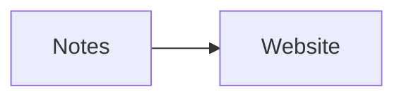

# Graphite Draft

[](https://github.com/fopwoc/GraphiteDraft/actions/workflows/build.yml)

I hate writing websites, so I did a thing to never do so anymore.

Graphite Draft turns a directory of Markdown into a static website.

The directory tree becomes the URL tree. The links in your Markdown become the
navigation. Images and other files stay beside the pages that use them. There is
no site structure to configure, no component library to assemble, and no client
framework shipped to the browser.

Write Markdown. Get a website.

## What it does

Given this:

```text
notes/
├── index.md
├── icon.svg
├── guide/
│   ├── index.md
│   ├── getting-started.md
│   └── diagram.svg
└── 404.mdx
```

Graphite Draft produces this:

```text
dist/
├── index.html
├── icon.svg
├── guide/
│   ├── index.html
│   ├── getting-started/
│   │   └── index.html
│   └── diagram.svg
└── 404.html
```

Graphite Draft validates local links and images, rewrites Markdown links to clean
URLs, and copies every non-Markdown file into the output. The result is ordinary
static HTML that can be hosted anywhere.

## Use it with GitHub Pages

This is the easiest option when the Markdown already lives in a GitHub
repository.

Create `.github/workflows/pages.yml` in that repository:

```yaml
name: Publish Markdown

on:
  push:
    branches: [main]

permissions:
  contents: read
  pages: write
  id-token: write

concurrency:
  group: pages
  cancel-in-progress: true

jobs:
  build:
    runs-on: ubuntu-latest
    steps:
      - uses: actions/checkout@v6
      - name: Build website
        uses: fopwoc/GraphiteDraft@v0
        with:
          source: notes
          output: dist
      - uses: actions/configure-pages@v5
      - uses: actions/upload-pages-artifact@v4
        with:
          path: dist

  deploy:
    environment:
      name: github-pages
      url: ${{ steps.deployment.outputs.page_url }}
    runs-on: ubuntu-latest
    needs: build
    steps:
      - name: Deploy
        id: deployment
        uses: actions/deploy-pages@v4
```

Change `source: notes` to the directory containing your Markdown. Then open your
repository's **Settings → Pages** and select **GitHub Actions** as the source.

Every push to `main` will validate the content, build the site, and publish it to
GitHub Pages.

### Action inputs

| Input | Default | Meaning |
| --- | --- | --- |
| `source` | `.` | Markdown directory, relative to the repository root |
| `output` | `dist` | Directory where the static website is written |
| `site` | `auto` | Canonical site origin; `auto` uses GitHub Pages |
| `enable-external-fonts` | `false` | Allow Mermaid diagrams to load Google Fonts |

The action exposes the final directory as the `path` output if another step
needs it.

## Use it with Docker

Pull the published image from GitHub Container Registry:

```sh
docker pull ghcr.io/fopwoc/graphitedraft:latest
```

Then mount the Markdown directory at `/content` and an empty output directory at
`/output`:

```sh
mkdir -p dist

docker run --rm \
  -v "$PWD/notes:/content:ro" \
  -v "$PWD/dist:/output" \
  ghcr.io/fopwoc/graphitedraft:latest
```

The finished website will be in `./dist`. Both mount paths must be absolute;
`$PWD` takes care of that on macOS and Linux.

Mermaid diagrams use system fonts by default, so the generated site does not
contact an external font service. To opt in to Google Fonts:

```sh
docker run --rm \
  -e GRAPHITE_ENABLE_EXTERNAL_FONTS=true \
  -v "$PWD/notes:/content:ro" \
  -v "$PWD/dist:/output" \
  ghcr.io/fopwoc/graphitedraft:latest
```

For reproducible builds, replace `latest` with a full release such as `0.1.0`,
or follow a compatible release line with `0.1` or `0`.

To build the image yourself instead:

```sh
docker build -t graphite-draft https://github.com/fopwoc/GraphiteDraft.git
```

Serve or copy `dist/` with any static host: nginx, Netlify, an object store, a
USB stick, or something considerably stranger.

## Use the CLI

The CLI requires Node.js 22.12 or newer. Install it globally from npm:

```sh
npm install --global graphite-draft
```

Check a Markdown directory without keeping any generated files:

```sh
graphite-draft check ./notes
```

`check` fully renders the site and exits with a non-zero status for problems such
as a broken local link, a missing image, invalid Markdown, or an invalid Mermaid
diagram. It is useful in CI even when another service performs the deployment.

Build the website:

```sh
graphite-draft build ./notes ./dist
```

The first argument is the Markdown source directory. The second is the output
directory and defaults to `./dist`:

```text
graphite-draft check [source]
graphite-draft build [source] [output] [--enable-external-fonts]
```

You can also run it without a global installation:

```sh
npx graphite-draft check ./notes
npx graphite-draft build ./notes ./dist
```

## Write pages

Both `.md` and `.mdx` files are supported. MDX is an escape hatch, not a
requirement.

Frontmatter is optional:

```md
---
title: A useful page title
draft: false
---

The page starts here.
```

- `title` sets the browser title and renders the page heading. Without it, the
  title is derived from the filename.
- `draft: true` leaves the page out of the build.
- `index.md` becomes the page for its directory.
- `404.md` or `404.mdx` becomes a self-contained `404.html`.
- A root `icon.svg` becomes the favicon.
- A Markdown image title becomes a visible caption.

Fenced Mermaid blocks are rendered to SVG during the build:

````md

````

The default output also includes GitHub-flavored Markdown, syntax highlighting,
copyable code blocks, heading anchors, responsive typography, and automatic
light and dark modes.

## The non-features are the point

Graphite Draft does not generate navigation. It does not invent a content model.
It does not ask you to configure a theme, run a CMS, hydrate a JavaScript app, or
reorganize your writing around a website framework.

Your files are the content model. Your links are the navigation. The defaults are
the theme.

That is the whole thing.
