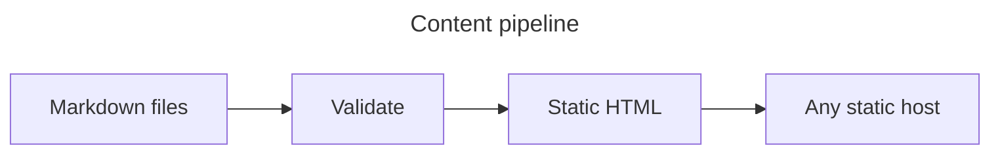

# Header 1
## Header 2
### Header 3
#### Header 4
##### Header 5
###### Header6

Alternatively, for H1 and H2, an underline-ish style:

Alt-H1
======

Alt-H2
------

## Formatting and links

Use **bold**, *italic*, ***both***, ~~strikethrough~~, `inline code`,
<mark>highlighting</mark>, and <kbd>keyboard labels</kbd>. Relative links can open
[a focused feature](./links-and-routing.md), [a copied file](../assets/example.txt), or
[another heading](./code.md#multiple-languages). Even [heading inside document](#code).

> A blockquote supports **formatting**, *emphasis*, and `code`.


> [!IMPORTANT]
> GitHub-style alerts work without custom components.

> [!TIP]
> The source remains readable on GitHub and in a text editor.

> Also, a blockquote
> > And a blockquote inside blockquote
>
> And text below
>
> > [!IMPORTANT]
> > And above once more but that is important now
> > > [!TIP]
> > > Tip of the day - never write Markdown like this <sub><sub>(prove me wrong)</sub></sub>

## Lists, tasks, and a table

1. Validate the content.
2. Render the pages.
3. Publish the directory.

- Bullet 1
- Bullet 2
- Bullet 3


- [x] Markdown parsed
- [x] Links checked
- [ ] Website deployed

| Source | Output | Browser runtime |
| --- | --- | --- |
| Markdown | HTML | None |
| Mermaid | SVG | None |
| MDX with a script | HTML + JavaScript | Opt-in |

## Lists

1. First ordered list item
2. Another item
   ⋅⋅⋅⋅* Unordered sub-list.
1. Actual numbers don't matter, just that it's a number
   ⋅⋅⋅⋅1. Ordered sub-list
4. And another item.

⋅⋅⋅You can have properly indented paragraphs within list items. Notice the blank line above, and the leading spaces (at least one, but we'll use three here to also align the raw Markdown).

⋅⋅⋅To have a line break without a paragraph, you will need to use two trailing spaces.⋅⋅
⋅⋅⋅Note that this line is separate, but within the same paragraph.⋅⋅
⋅⋅⋅(This is contrary to the typical GFM line break behaviour, where trailing spaces are not required.)

* Unordered list can use asterisks
- Or minuses
+ Or pluses

## Code

```js
const result = await build({ source: "notes", output: "dist" });
console.log(result.pages);
```

```kotlin
import kotlinx.coroutines.*

suspend fun main() {                                // A function that can be suspended and resumed later
    val start = System.currentTimeMillis()
    coroutineScope {                                // Create a scope for starting coroutines
        for (i in 1..10) {
            launch {                                // Start 10 concurrent tasks
                delay(3000L - i * 300)              // Pause their execution
                log(start, "Countdown: $i")
            }
        }
    }
    // Execution continues when all coroutines in the scope have finished
    log(start, "Liftoff!")
}

fun log(start: Long, msg: String) {
    println("$msg " +
            "(on ${Thread.currentThread().name}) " +
            "after ${(System.currentTimeMillis() - start)/1000F}s")
}
```

```rust
// This is a simple macro named `say_hello`.
macro_rules! say_hello {
    // `()` indicates that the macro takes no argument.
    () => {
        // The macro will expand into the contents of this block.
        println!("Hello!")
    };
}

fn main() {
    // This call will expand into `println!("Hello!")`
    say_hello!()
}
```

## Mermaid



## Image and native elements


<details>
  <summary>Everything on this page is still Markdown</summary>
  Native HTML elements are allowed where Markdown has no equivalent.
</details>

<dl>
  <dt>Definition list</dt>
  <dd>Is something people use sometimes.</dd>

  <dt>Markdown in HTML</dt>
  <dd>Does *not* work **very** well. Use HTML <em>tags</em>.</dd>
</dl>

## YouTube inline

[](http://www.youtube.com/watch?v=tYzMYcUty6s)

[Back to examples](../index.md)
