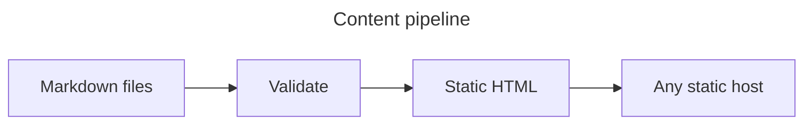

# Header 1
## Header 2
### Header 3
#### Header 4
##### Header 5
###### Header6

Alternatively, for H1 and H2, an underline-ish style:

Alt-H1
======

Alt-H2
------

## Formatting and links

Use **bold**, *italic*, ***both***, ~~strikethrough~~, `inline code`,
<mark>highlighting</mark>, and <kbd>keyboard labels</kbd>. Relative links can open
[a focused feature](./links-and-routing.md), [a copied file](../assets/example.txt), or
[another heading](./code.md#multiple-languages). Even [heading inside document](#code).

> A blockquote supports **formatting**, *emphasis*, and `code`.


> [!IMPORTANT]
> GitHub-style alerts work without custom components.

> [!TIP]
> The source remains readable on GitHub and in a text editor.

> Also, a blockquote
> > And a blockquote inside blockquote
>
> And text below
>
> > [!IMPORTANT]
> > And above once more but that is important now
> > > [!TIP]
> > > Tip of the day - never write Markdown like this <sub><sub>(prove me wrong)</sub></sub>

## Lists, tasks, and a table

1. Validate the content.
2. Render the pages.
3. Publish the directory.

- Bullet 1
- Bullet 2
- Bullet 3


- [x] Markdown parsed
- [x] Links checked
- [ ] Website deployed

| Source | Output | Browser runtime |
| --- | --- | --- |
| Markdown | HTML | None |
| Mermaid | SVG | None |
| MDX with a script | HTML + JavaScript | Opt-in |

## Lists

1. First ordered list item
2. A second item with nested content.
   - Unordered child
   - Another child
3. A final item.

   An indented paragraph remains attached to the final list item.

   Two trailing spaces create a line break.  
   This line stays in the same paragraph.

* Unordered items can use asterisks.
- Hyphens work too.
+ Plus signs are also valid.

## Code

```js
const result = await build({ source: "notes", output: "dist" });
console.log(result.pages);
```

```kotlin
import kotlinx.coroutines.*

suspend fun main() = coroutineScope {
    val pages = listOf("index", "guide", "reference")
    pages.map { page ->
        async {
            delay(25)
            "Rendered $page"
        }
    }.awaitAll().forEach(::println)
}
```

```rust
macro_rules! markdown_heading {
    ($level:literal, $text:literal) => {
        format!("{} {}", "#".repeat($level), $text)
    };
}

fn main() {
    println!("{}", markdown_heading!(2, "Generated section"));
}
```

## Mermaid



## Image and native elements


<details>
  <summary>Everything on this page is still Markdown</summary>
  Native HTML elements are allowed where Markdown has no equivalent.
</details>

<dl>
  <dt>Definition list</dt>
  <dd>Is something people use sometimes.</dd>

  <dt>Markdown in HTML</dt>
  <dd>Does *not* work **very** well. Use HTML <em>tags</em>.</dd>
</dl>

## Linked image

[](../index.md)

[Back to examples](../index.md)
