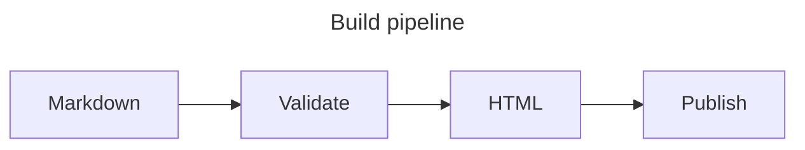
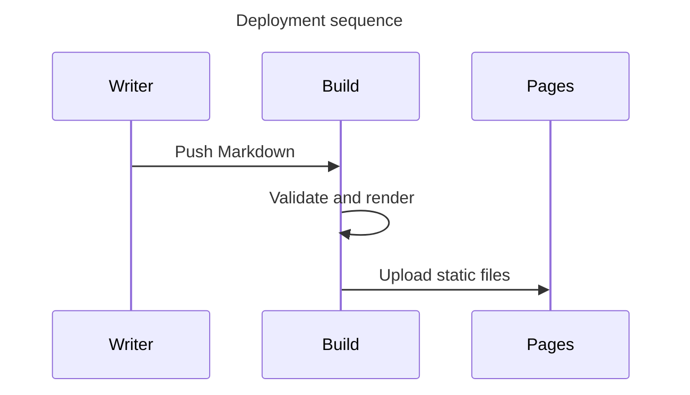
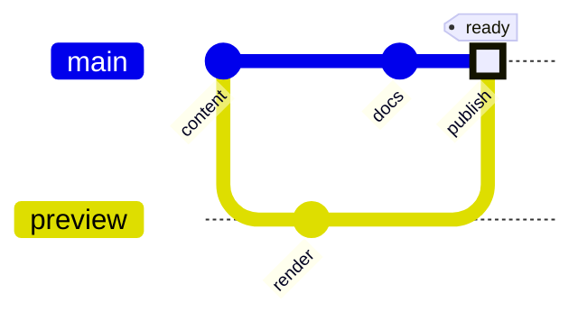
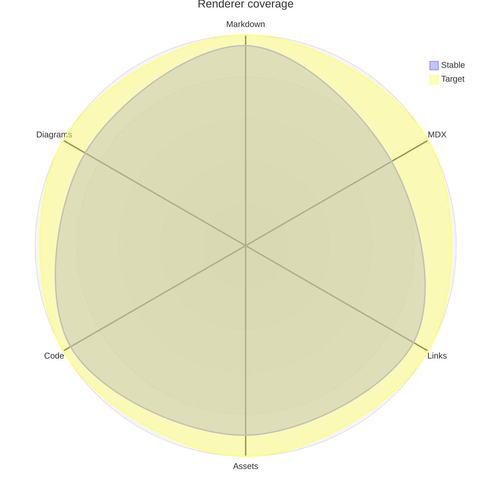
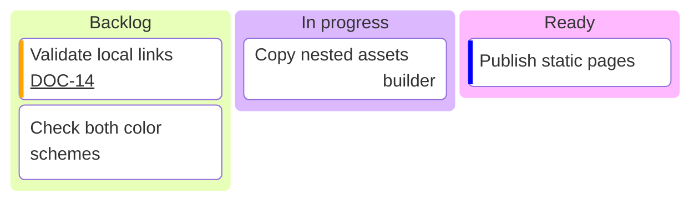
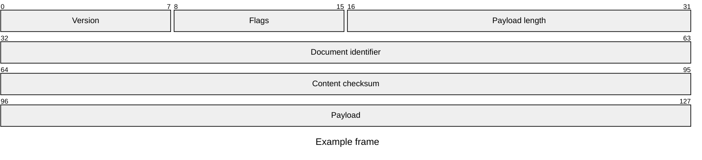

All diagrams are baked into light and dark SVG during the build. Mermaid is not
shipped to the browser.

```mermaid
---
title: Build pipeline
---
flowchart LR
  Markdown --> Validate
  Validate --> HTML
  HTML --> Publish
```

```mermaid
---
title: Deployment sequence
---
sequenceDiagram
  participant Writer
  participant Build
  participant Pages
  Writer->>Build: Push Markdown
  Build->>Build: Validate and render
  Build->>Pages: Upload static files
```

```mermaid
    gitGraph
       commit id: "content"
       branch preview
       checkout preview
       commit id: "render"
       checkout main
       commit id: "docs"
       merge preview id: "publish" tag: "ready" type: HIGHLIGHT

```

```mermaid
---
title: "Renderer coverage"
---
radar-beta
  axis m["Markdown"], x["MDX"], l["Links"]
  axis a["Assets"], c["Code"], d["Diagrams"]
  curve stable["Stable"]{95, 80, 92, 90, 96, 88}
  curve target["Target"]{100, 100, 100, 100, 100, 100}

  max 100
  min 0

```

```mermaid
---
config:
      kanban:
        ticketBaseUrl: 'https://example.com/issues/#TICKET#'
---
kanban
  backlog[Backlog]
    links[Validate local links]@{ ticket: DOC-14, priority: 'High' }
    themes[Check both color schemes]
  active[In progress]
    assets[Copy nested assets]@{ assigned: 'builder' }
  ready[Ready]
    pages[Publish static pages]@{ priority: 'Low' }
```

```mermaid
---
title: "Example frame"
---
packet
0-7: "Version"
8-15: "Flags"
16-31: "Payload length"
32-63: "Document identifier"
64-95: "Content checksum"
96-127: "Payload"
```

[Back to examples](../index.md)
