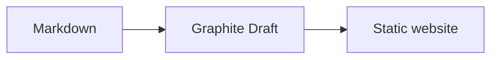

Point Graphite Draft at a Markdown directory. Its hierarchy becomes the website hierarchy.

There is no generated navigation. The links written in your Markdown are the website navigation.

## Zero-rewrite Markdown

Relative links continue to work when pages become clean URLs:

- [Read the guide](./guide/getting-started.md)
- Images can live beside Markdown: ``
- Other relative files are copied into the static output

## Code highlighting

```ts
const pages = await build("./content");
```

## Mermaid



## Native elements

> The default presentation stays quiet so the Markdown remains the focus.

| Input | Output |
| --- | --- |
| Markdown | Static HTML |
| Mermaid | Inline SVG |

<details>
  <summary>Small details stay native</summary>
  No component runtime is required.
</details>

Press <kbd>Enter</kbd> on a code block to copy it, or <mark>just click it</mark>.
